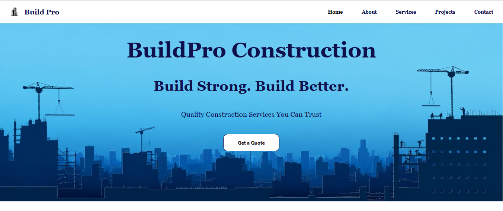
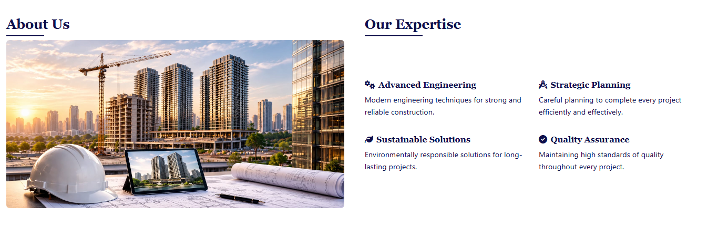
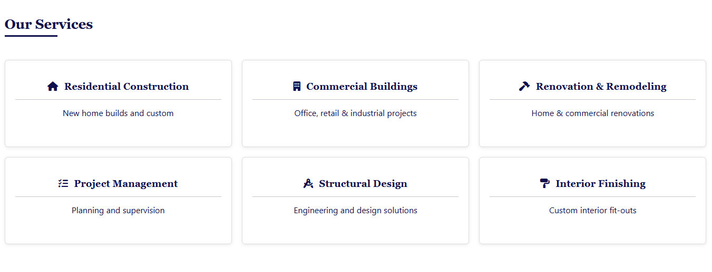
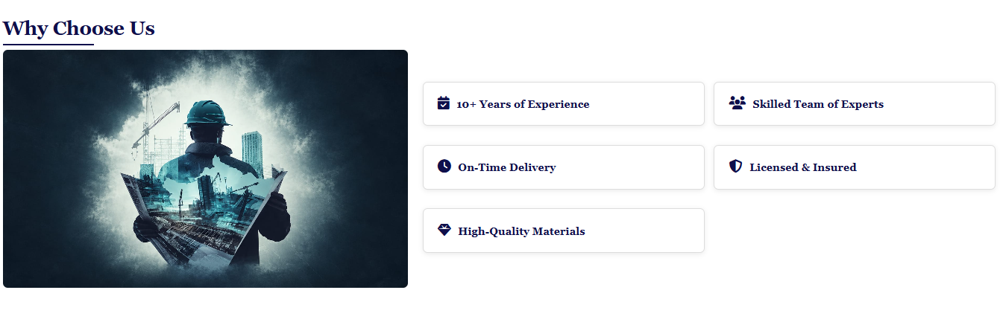
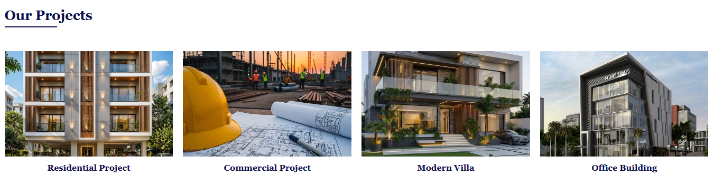
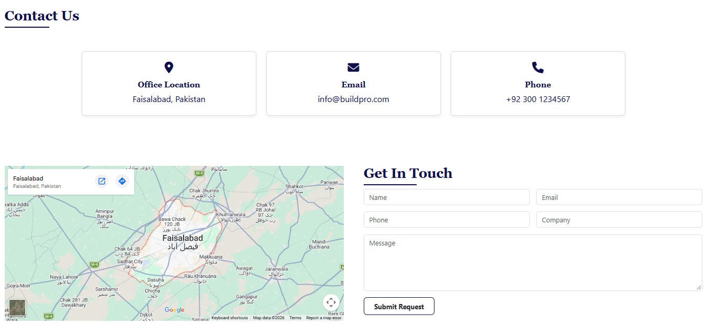

## Construction Company Website🏗️

Construction company website is a simple and responsive website designed to present a construction company's services, projects and contact information.The website provides a clean and user-friendly interface for visitors to explore the company's work and services.

## 🔗Live Demo
https://construction-company-inky.vercel.app/

## 📸Screenshots
<table>
   <tr>
     <td align="center"><b>Home Page</b> </td>
     <td align="center"><b>About Section</b> </td>
   </tr>
   <tr>
     <td align="center"><b>Services Section</b> </td>
     <td align="center"><b>Why-us Section</b> </td>
   </tr>
   <tr>
     <td align="center"><b>Projects Section</b> </td>
     <td align="center"><b>Contact Section</b> </td>
   </tr>
   <tr>
     <td align="center"><b>Footer</b> </td>
   </tr>
</table>

## ✨Features

* Fully responsive layout (mobile, tablet, desktop)
* Sticky/collapsible Bootstrap navbar with smooth scroll navigation
* Hero section with construction services and call-to-action
8 About section with company introduction and construction image
* Services section showcasing construction and building services
* Projects section displaying completed construction projects
* Image gallery showcasing company work
* Contact section with company details and inquiry information
* Footer with social links and contact details

## 🛠️Built With

* **HTML5** - page structure
* **CSS3** - custom styling (colors, typography, hover effects)
* **Bootstrap 5.3.8** - responsive grid, navbar, and utility classes
* **Font Awesome 6.5.0** - social media icons

## ✍️Author 

**Laiba Fatima**
Frontend Developer

* GitHub: https://github.com/laibafatima-05
* LinkedIn: https://www.linkedin.com/in/lyba-fatima?

## 📄License 

The project is open source and available for personal or educational use.
